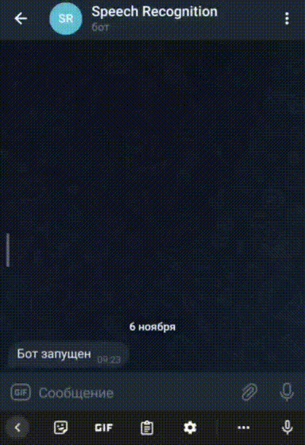

# Чатбот Telegram обученный через DialogFlow.

Проект по интеграции Google API DialogFlow в телеграмм-бот и в группу Вконтакте через модули python-telegram-bot.

Пример работы ботов:  
,  

## Настройки

* Необходимо зарегистрироваться в [Google Cloud](https://cloud.google.com).
* [Создать проект в DialogFlow](https://cloud.google.com/dialogflow/es/docs/quick/setup#project) 
  и забрать ваш идентификатор проекта(project_id).
* [Создать агента DialogFlow](https://cloud.google.com/dialogflow/es/docs/quick/build-agent#create-an-agent).
* Натренируйте DialogFlow создав intent вручную, либо можете воспользоваться 
  скриптом `сreate_intent.py`([описание ниже](#обучение-dialogflow-через-api)).
* Создайте [JSON-ключ](https://cloud.google.com/docs/authentication/getting-started#creating_a_service_account).
* Создать бота в Telegram через специального бота:
[@BotFather](https://telegram.me/BotFather), забрать API ключ и написать 
созданному боту.
* Забрать свой `chat_id` через [@userinfobot](https://telegram.me/userinfobot) - 
  необходим для получения логов (ошибки будут идти именно этому пользователю).
* Создать группу в [Вконтакте](https://vk.com/groups?tab=admin) и в настройках 
  группы -> "Работа с API" создать API-ключ с правами: "Управление группой", 
  "Отправка сообщений".

### Переменные окружения

Создайте файл `.env` в корневой папке с кодом и запишите туда:
```
PROJECT_ID=ВАШ_PROJECT_ID
GOOGLE_APPLICATION_CREDENTIALS=ПУТЬ_ДО_JSON_КЛЮЧА
TG_TOKEN=ВАШ_TELEGRAM_API_КЛЮЧ
TG_CHAT_ID=ВАШ_CHAT_ID
VK_TOKEN=ВАШ_API_КЛЮЧ_ВК
```

## Запуск программы

Для запуска у вас уже должен быть установлен [Python 3](https://www.python.org/downloads/release/python-379/).

- Скачайте код.
- Установите зависимости командой:
```
pip install -r requirements.txt
```
- Запустите скрипт командой: 
```
python tg_bot.py
```
```
python vk_test_bot.py
```

Боты обучены распознавать вольную речь на следующие темы:
```
Приветствие
Устройство на работу
Забыл пароль
Удаление аккаунта
Вопросы от забаненных
Вопросы от действующих партнёров(совещания, контракты)
```

## Обучение DialogFlow через API

Создайте файл `questions.json` в корневой папке c проектом, внесите вопросы и 
ожидаемый ответ, в формате:
```
{
    "Устройство на работу": {
        "questions": [
            "Как устроиться к вам на работу?",
            "Как устроиться к вам?",
            "Как работать у вас?",
            "Возможно-ли устроиться к вам?",
            "Можно-ли мне поработать у вас?"
        ],
        "answer": "Если вы хотите устроиться к нам, напишите на почту game-of-verbs@gmail.com мини-эссе о себе и прикрепите ваше портфолио."
    },
    "Забыл пароль": {
        "questions": [
            "Забыл пароль",
            "Забыл логин",
            "Как восстановить пароль",
            "Неправильный логин или пароль",
            "Не могу войти в аккаунт"
        ],
        "answer": "Если вы не можете войти на сайт, воспользуйтесь кнопкой «Забыли пароль?» под формой входа. Вам на почту прийдёт письмо с дальнейшими инструкциями. Проверьте папку «Спам», иногда письма попадают в неё."
    }
    ...
}
```
- Запустите скрипт командой:
```
python сreate_intent.py
```
- При необходимости название Json файла можно задать следующим образом:
```
python сreate_intent.py -p [Название файла]
```

### Цель проекта

Код написан в образовательных целях на онлайн-курсе для веб-разработчиков [dvmn.org](https://dvmn.org/).
 